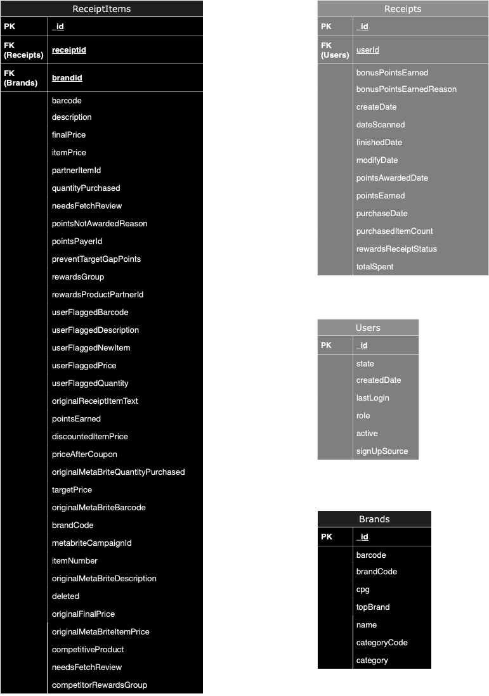

# Fetch Rewards Coding Exercise - Analytics Engineer

## Requirements
1. Review unstructured JSON data and diagram a new structured relational data model
2. Generate a query that answers a predetermined business question
3. Generate a query to capture data quality issues against the new structured relational data model
4. Write a short email or Slack message to the business stakeholder

## Tools
* In part one, *Python Jupyter notebook* is used for data exploration.
* In part two, *MySQL* dialect is used for SQL queries.
* In part three, *Python* is used for data quality checks.

## Solution
### Part 1: ER diagram
The ER diagram was created based on the following observations and considerations:
1. Following the naming conventions of the three provided JSON files, I named the tables as `Receipts`, `Users` and `Brands`.
    * All tables contain a unique  `_id` field, which we will use as the primary key.
2. For the data model, `Receipts` functions as the fact table, while `Users` and `Brands` serve as dimension tables. We can establish the following foreign key relationships:
    * The `userId` field in `Receipts` serves as a foreign key linking to the `_id` field `Users`.
    * Since no clear foreign key connects `Receipts` to `Brands`, we will create one named `brandId`.
3.For normalization, the `rewardsReceiptItemList` field in `Receipts.json` contains a list of dictionaries. Flattening this structure into a single table would result in a large, complex dataset (either a wide table or a lengthy table), which could slow down queries—especially if the business team is primarily interested in receipt-level, not item-level, details. To improve query performance, simplify maintenance, and keep the data model intuitive, I recommend normalizing this field into a separate table named `ReceiptItems`.

Based on the analysis above, and the results from `./script/data_exploration.ipynb` that lists all the columns in the JSON files, I created the following ER diagram using Crow’s Foot notation:



### Part 2: SQL queries
All six queries are answered below using MySQL syntax.
#### What are the top 5 brands by receipts scanned for most recent month?

The solution is based on the understanding that if a receipt has 5 items, 3 of which are from brand A and 2 are from brand B. This will contribute 3 to brand A and 2 to brand B total receipt counts.

```sql
SELECT b.name, COUNT(r._id) as receipts_count
FROM ReceiptItems ri
JOIN Receipts r
ON ri.receiptid = r._id
JOIN Brands b
ON ri.brandid = b._id
WHERE MONTH(r.dateScanned) = MONTH(CURDATE())
GROUP BY b.name
ORDER BY receipts_count DESC
LIMIT 5
;
```
#### How does the ranking of the top 5 brands by receipts scanned for the recent month compare to the ranking for the previous month?
```sql
WITH cur_month AS (
  SELECT b.name, COUNT(r._id) as receipts_count, ROW_NUMBER() OVER (ORDER BY COUNT(r._id) DESC) as rank
  FROM ReceiptItems ri
  JOIN Receipts r
  ON ri.receiptid = r._id
  JOIN Brands b
  ON ri.brandid = b._id
  WHERE MONTH(r.dateScanned) = MONTH(CURRENT_DATE())
  GROUP BY b.name
  ORDER BY receipts_count DESC
  LIMIT 5
), prev_month AS (
  SELECT b.name, COUNT(r._id) as receipts_count, ROW_NUMBER() OVER (ORDER BY COUNT(r._id) DESC) as rank
  FROM ReceiptItems ri
  JOIN Receipts r
  ON ri.receiptid = r._id
  JOIN Brands b
  ON ri.brandid = b._id
  WHERE MONTH(r.dateScanned) = MONTH(CURRENT_DATE()) - 1
  GROUP BY b.name
)

SELECT cur_month.name as name, cur_month.rank as cur_rank, prev_month.rank as prev_rank, (cur_month.rank - COALESCE(prev_month.rank, 0)) as rank_change
FROM cur_month
LEFT JOIN prev_month
ON cur_month.name = prev_month.name
;
```
#### When considering average spend from receipts with 'rewardsReceiptStatus’ of ‘Accepted’ or ‘Rejected’, which is greater?
```sql
SELECT rewardsReceiptStatus, AVG(totalSpent) as avg_spend
FROM Receipts
WHERE rewardsReceiptStatus IN ('Accepted', 'Rejected')
GROUP BY rewardsReceiptStatus
;
```
#### When considering total number of items purchased from receipts with 'rewardsReceiptStatus’ of ‘Accepted’ or ‘Rejected’, which is greater?
```sql
SELECT rewardsReceiptStatus, SUM(purchasedItemCount) as total_item_count
FROM Receipts
WHERE rewardsReceiptStatus IN ('Accepted', 'Rejected')
GROUP BY rewardsReceiptStatus
;
```
#### Which brand has the most spend among users who were created within the past 6 months?
```sql
SELECT b.name AS name, SUM(ri.totalSpent) as total_spend
FROM ReceiptsItems ri
JOIN Brands b
ON ri.brandid = b._id
WHERE userId IN (
    SELECT userId
    FROM Users
    WHERE createdDate >= DATE_SUB(CURDATE(), INTERVAL 6 MONTH)
)
GROUP BY ri.brandid
ORDER BY total_spend DESC
LIMIT 1
;
```
#### Which brand has the most transactions among users who were created within the past 6 months?
The solution is based on the understanding that each receipt counts as one transaction, regardless of the number of items in the receipt. 
For example, a receipt has 5 items, 3 of which are from brand A and 2 are from brand B. This will contribute 1 to brand A and 1 to brand B total transaction counts.

```sql
WITH ReceiptsItems_distinct as (
    SELECT DISTINCT brandid, receiptid
    FROM ReceiptsItems
)

SELECT b.name AS name
FROM ReceiptsItems_distinct ri
JOIN Brands b
ON ri.brandid = b._id
WHERE userId IN (
    SELECT userId
    FROM Users
    WHERE createdDate >= DATE_SUB(CURDATE(), INTERVAL 6 MONTH)
)
GROUP BY ri.brandid
ORDER BY COUNT(*) DESC
LIMIT 1
;
```

### Part 3: Data quality
For data quality, I have developed functions that can test the following:
1. Duplicate row of a table
2. Check column Unique
3. Check column NULL
4. Foreign key constraint

For rule 1 and 2, we will need to clarify which colunmn cannot be null or has to be unique. As for now, I am only checking the primary keys. Here's a brief summary from `./script/dq_check.py`. The DQ reports can also be found in `./dq_report` folder.
```markdown
Users
dq1: check for duplicate rows
_id:  283
dq2: check column unique
_id:  283
dq3: check column missing
_id:  0

Brands
dq1: check for duplicate rows
_id:  0
dq2: check column unique
_id:  0
dq3: check column missing
_id:  0

Receipts
dq1: check for duplicate rows
_id:  0
dq2: check column unique
_id:  0
dq3: check column missing
_id:  0
dq4: check foreign key constraint
userId not in Users table:  148
```

You may also execute with the following commands to run on your laptop:
```python
source ./my_virtual_env/bin/activate
python3 ./script/dq_check.py
```

Additionally, a potential DQ violation is that the fields Category doesn't guarantee 1:1 mapping to Category Code in `brands.json`. Please see `email.txt` for the final summary.

### Part 4: Communicate with stakeholder
Please refer to `email.txt`.